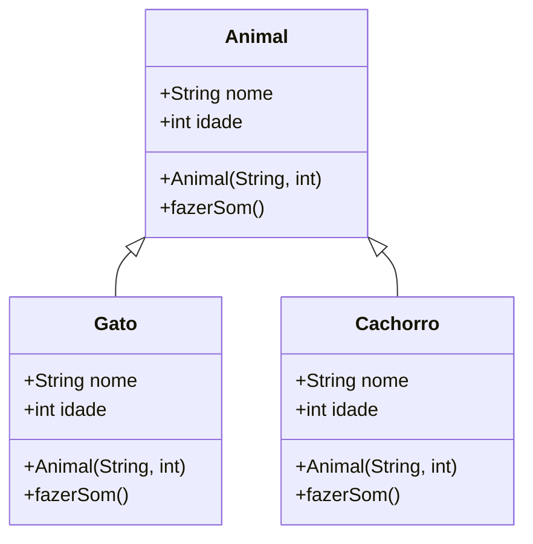

```mermaid
    classDiagram
    class Animal {
        +String nome
        +int idade
        +Animal(String, int)
        +fazerSom()
    }
    class Gato {
        +String nome
        +int idade
        +Animal(String, int)
        +fazerSom()
    }
    class Cachorro {
        +String nome
        +int idade
        +Animal(String, int)
        +fazerSom()
    }
    Animal <|-- Gato
    Animal <|-- Cachorro
```